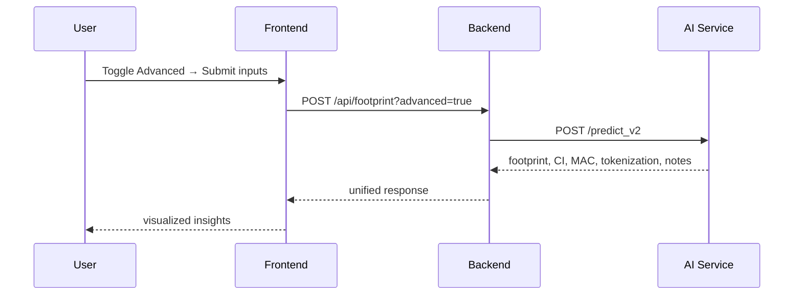

# Carbon-Neural: AI-Powered Decentralized Carbon Footprint Optimization

A hackathon-ready platform combining AI-driven carbon footprint analysis, autonomous optimization agents, and Hedera for tokenized carbon credits.

## Vision

-   **AI-Powered Insights**: Go beyond simple estimates with advanced analytics, including uncertainty quantification and cost-effective optimization paths.
-   **Decentralized & Verifiable**: Mint carbon credits automatically on Hedera based on verified emission reductions.
-   **Autonomous Agents**: Receive actionable, AI-driven suggestions to improve sustainability.
-   **Premium UX**: Glassmorphism UI, smooth animations, informative tooltips.

## Features

| Capability | Standard Engine | Advanced Engine (V2) |
|---|---|---|
| Daily footprint | ✅ | ✅ |
| Guidance notes | ✅ | ✅ (richer) |
| Uncertainty bands (90% CI) | – | ✅ |
| Emission breakdown | – | ✅ |
| Marginal Abatement Cost ranking | – | ✅ |
| Tokenization preview (credits/month) | – | ✅ |

> Tip: Toggle “Use Advanced Engine” in the dashboard to switch engines.

## Architecture

```mermaid
flowchart LR
    UI[React + Vite\nDashboard] -->|POST /api/footprint\n(?advanced=true)| B(Express Backend)
    B -->|proxy| A1[/AI: /predict/]
    B -->|proxy (advanced)| A2[/AI: /predict_v2/]
    B --> H[(Hedera HTS)]
    A2 -->|uncertainty, MAC, tokenization| UI
```

### Request Lifecycle (Advanced)



## Repository Structure

```
carbon-neural/
├── contracts/      # Hedera HTS contracts/configs
├── backend/        # Node.js API + Hedera SDK + agents
├── ai/             # Python FastAPI microservice
├── frontend/       # React + Vite dashboard
├── data/           # Sample datasets + oracle scripts
├── docs/           # Pitch deck, architecture, etc.
└── tests/          # Unit + integration tests
```

## Quickstart

Run each service in a separate terminal.

### 1. AI Service (FastAPI)

```bash
# Terminal 1: AI Service
cd ai
python -m venv .venv
# Activate virtual environment
# Windows PowerShell:
. .venv\Scripts\Activate.ps1
# macOS/Linux:
# source .venv/bin/activate

pip install -r requirements.txt
python -m uvicorn app:app --host 0.0.0.0 --port 8001
```

### 2. Backend (Node.js + Express)

```bash
# Terminal 2: Backend
cd backend
npm install
# Create .env from .env.example and add your Hedera credentials
# Example for Windows:
copy .env.example .env
npm run dev
```

### 3. Frontend (React + Vite)

```bash
# Terminal 3: Frontend
cd frontend
npm install
npm run dev
```

Navigate to `http://localhost:5173` to use the application.

## Demo Flow

1.  The user interacts with the frontend dashboard.
2.  Using the **"Use Advanced Engine"** toggle, the user selects an engine.
3.  **Frontend** calls **Backend** at `POST /api/footprint` (with `?advanced=true` for the V2 engine).
4.  **Backend** proxies the request to the appropriate **AI service** endpoint:
    -   Standard: `POST /predict`
    -   Advanced: `POST /predict_v2`
5.  The **AI service** returns a detailed JSON response with the footprint, confidence intervals, abatement options, and tokenization data.
6.  The **Frontend** visualizes these advanced analytics in a professional, easy-to-understand format.

## Environment Variables

Create a `.env` file inside the `backend/` directory:

```
HEDERA_NETWORK=testnet
HEDERA_OPERATOR_ID=0.0.xxxxx
HEDERA_OPERATOR_KEY=302e02...
AI_URL=http://localhost:8001
PORT=8080
```

## Roadmap

-   Guardian integration for verifiable sustainability proofs.
-   On-chain verification contracts and attestation flow.
-   Advanced multi-sensor data ingestion and oracles.
-   Gamification: teams, seasons, NFT badges, and staking.

## License

MIT
